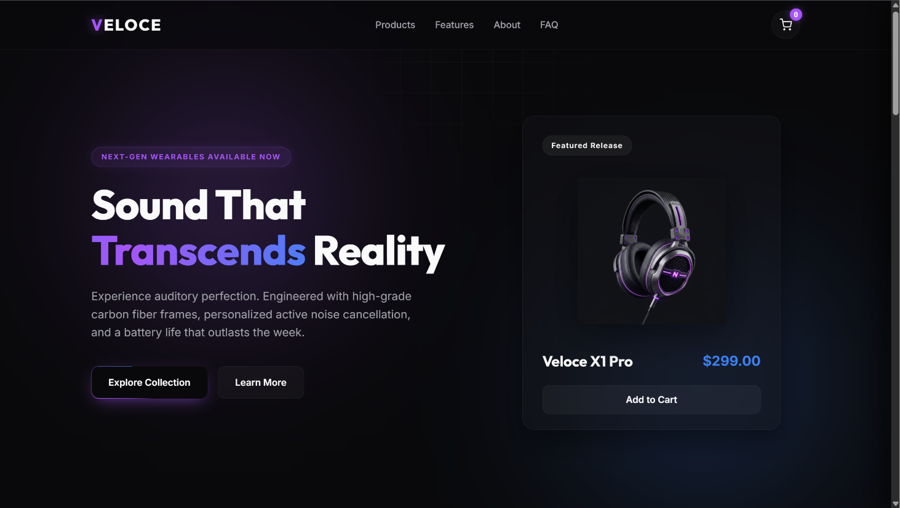
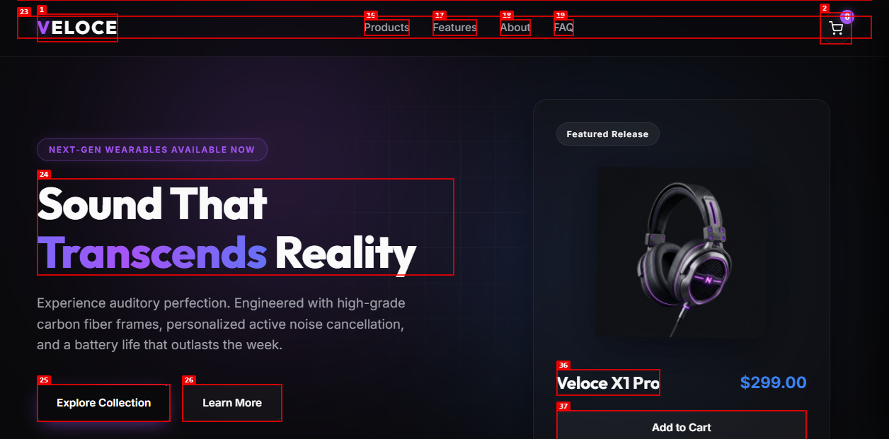
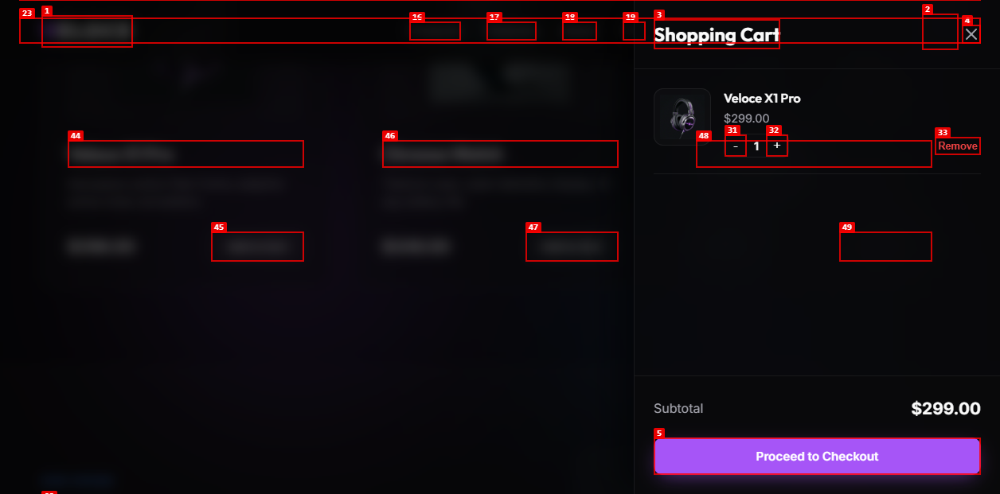

# Veloce Tech — Premium Wearables Landing Page

<<<<<<< HEAD
> 🚀 **Live Demo:** [https://nj-ai-skill-pack-usecase-ecommerce.vercel.app](https://nj-ai-skill-pack-usecase-ecommerce.vercel.app)
=======
> 🚀 **Live Demo:** [https://your-project-name.vercel.app]([https://your-project-name.vercel.app](https://nj-ai-skill-pack-usecase-ecommerce.vercel.app/))
>>>>>>> c384bee18be19b59f08889e775e12227e7635716

Veloce Tech is a futuristic, motion-rich e-commerce landing page built using vanilla web technologies. It features high-fidelity 3D interactive assets, cursor-following illumination grids, custom gradient animations, and a client-side shopping cart system.

---

## 🎯 Project Origin
This project was built to satisfy the prompt:
> *"create a simple landing page with reladed things to e commerce website"*

Using advanced agentic developer skills, this prompt was expanded into a premium streetwear-and-tech storefront design featuring modern motion layouts and complete stateful cart mechanics.

---

## 🛠️ Tech Stack & Features
- **Core Structure**: Semantic HTML5 markup.
- **Styling (Vanilla CSS)**:
  - Moving mesh background gradients.
  - Interactive grid spotlights tracking mouse moves.
  - 3D card tilt and translate lifts.
  - Custom rotating conic-gradient border sweeps.
- **Interactivity (Vanilla JS)**:
  - Event listeners mapping mouse vector paths.
  - Shopping cart state management (addition, removal, quantity tweaks, sum math).
  - Dynamic sliding cart drawer and toast notification alerts.

---

## 📸 Screenshots

### Product Design Showcase


### Initial Page Load State


### Interactive Shopping Cart Drawer


---

## 🚀 How the Custom Developer Skill Pack Was Used
This landing page was planned, designed, coded, and verified using a collection of custom agentic developer skills installed in this workspace:

1. **`nisal-global-orchestrator`**: Triaged development routing, orchestrating visual design constraints and testing flows.
2. **`nj-auto-planner`**: Maintained live task checklists (`task.md` and `implementation_plan.md`) to guide step-by-step progress.
3. **`nj-landing-page-design-guardian`**: Guided the high-converting page layout, ensuring clear headline sweeps and visible CTA rings.
4. **`nj-motionsites-design-guardian`**: Injected code patterns for HSL color tokens, 3D card rotations, and moving backdrop mesh blur filters.
5. **`agent-browser-verify`**: Directed local server verification using Puppeteer CLI commands to trigger mock clicks and capture page screenshots.
6. **`caveman`**: Controlled output formatting to keep engineering logs concise.

---

## 📦 Deployment on Vercel
This project is configured with a `vercel.json` file for routing. Follow these step-by-step instructions to deploy:

### Step 1: Install Vercel CLI
If not already installed, run:
```bash
npm install -g vercel
```

### Step 2: Login to Vercel
Authenticate with your account:
```bash
vercel login
```

### Step 3: Run Deploy Command
Start the deployment setup:
```bash
vercel
```

**Answer CLI interactive setup prompts:**
1. `Set up and deploy?` → Type `y` (yes) and press Enter.
2. `Which scope?` → Select your personal account or team and press Enter.
3. `Link to existing project?` → Type `N` (no) to create a new project.
4. `What’s your project’s name?` → Press Enter to accept default (`ecommerce-landing`) or enter custom name.
5. `In which directory is your code located?` → Press Enter to select current directory (`./`).
6. `Want to modify settings?` → Type `N` (no). Vercel will auto-detect settings and apply our `vercel.json` routing configurations.

### Step 4: Deploy to Production
To make the site live on your main URL:
```bash
vercel --prod
```
