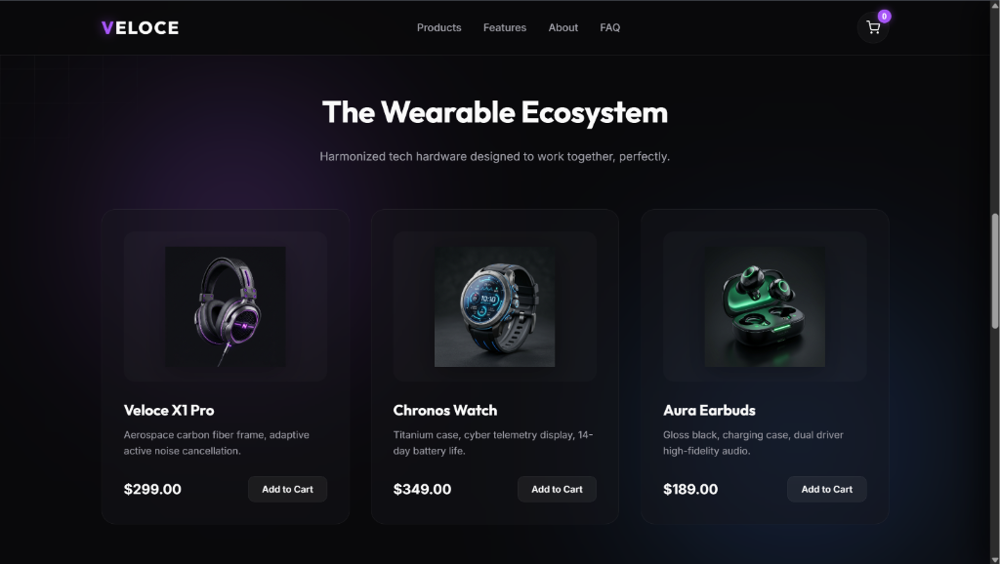

# Walkthrough: E-commerce Landing Page

We built **Veloce Tech**, a premium dark-themed single-page e-commerce landing page with animations, 3D mouse tracking, and interactive cart drawers.

## Changes Made
- Created directory: [ecommerce-landing](file:///C:/Users/nisal/.gemini/antigravity/scratch/ecommerce-landing)
- Created [index.html](file:///C:/Users/nisal/.gemini/antigravity/scratch/ecommerce-landing/index.html) with semantic structure.
- Created [style.css](file:///C:/Users/nisal/.gemini/antigravity/scratch/ecommerce-landing/style.css) with:
  - Moving mesh gradient background.
  - Interactive spotlight grid mask.
  - 3D card tilt transformations.
  - Conic-gradient border sweeps.
- Created [app.js](file:///C:/Users/nisal/.gemini/antigravity/scratch/ecommerce-landing/app.js) with cart state management, mouse move trackers, drawer toggle, and FAQ accordion events.
- Generated realistic product images using AI and saved them to the project assets directory.

## Visual Verification

### Initial Landing State
The landing page loaded successfully on a local web server, featuring smooth visual styles and responsive spacing:

---

### Product Ecosystem
The product grid displays the structured cards, visual AI assets, and individual checkout triggers:

---

### Interactive Shopping Cart
Added a product to the cart and opened the cart drawer to verify quantity controls, state updates, and checkout triggers:

